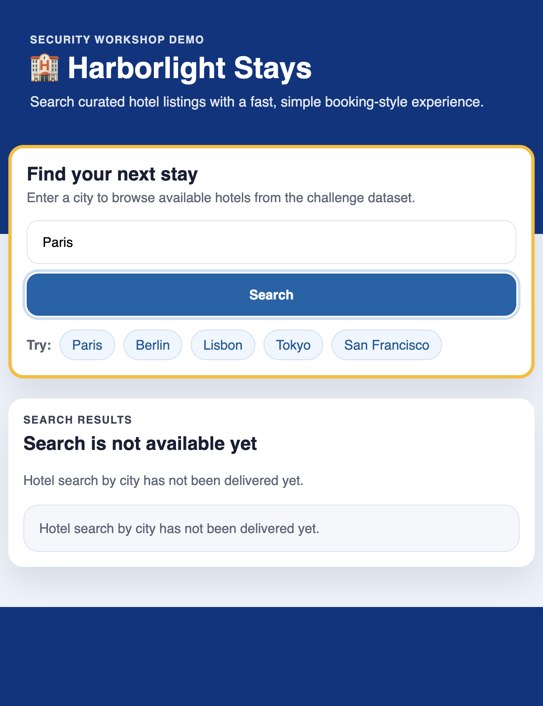
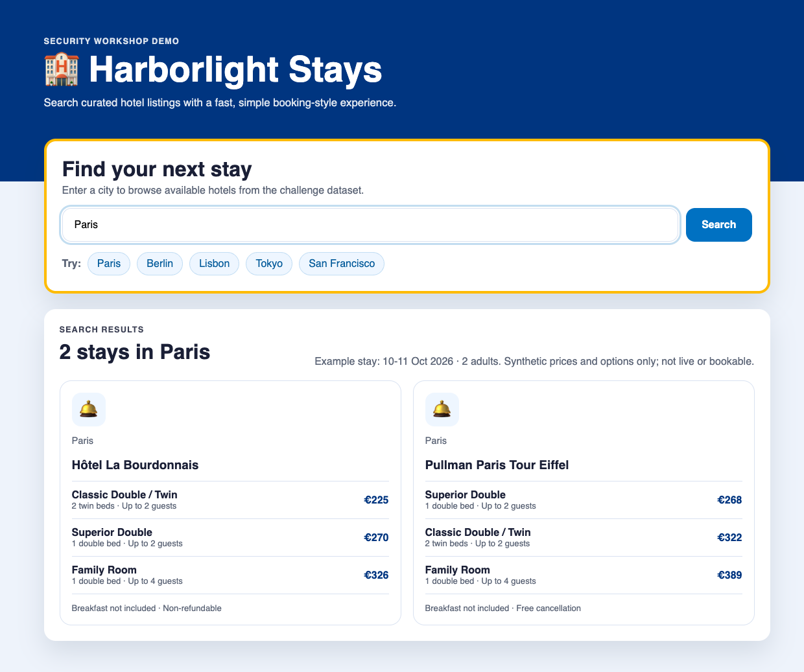

## Step 1: Recruit your team and deliver search

Terminal key: 🖥️ Terminal 1 is for participant shell commands; 🤖 Terminal 2 is
the Copilot CLI/Squad conversation for prompts. Run shell commands in Terminal 1
unless a command block names another terminal. 📖 introduces theory, ⌨️ introduces
activities, and other emoji are visual markers; follow the accompanying text.

### 📖 Theory: Separate responsibilities

Squad keeps a team's roles, decisions, and context in `.squad/`. Green integrates
the supplied training prototype and owns its initial feature branch. Red reviews
security. Blue implements the approved correction and delivers it to `main`
through a reviewed pull request. You decide who works next. Public listings use
real hotel names; prices, dates, room options and internal challenge records are
synthetic. Use only the supplied dataset and local or privately forwarded app
access. Never use customer, participant or production data.

Think of Squad as your coordinator, not an unattended pipeline. You give one
task, inspect its result, then choose the next task. Separate roles make it
easier to ask who implemented a change, who reviewed it, and who proposed the
correction. They do not remove your responsibility for any of those decisions.

The app begins with city search unavailable. Integrating the prototype changes
real application behavior; reading the prototype alone does not deliver the
feature. Start by checking ordinary city searches and recording how many
listings each search returns. The challenge-specific investigation comes later.

Public listings use real hotel names; prices, dates, room options and internal
challenge records are synthetic. The app does not show live availability or
accept bookings.



*🧱 At this point, the app is running, but city search has not been delivered.*

### ⌨️ Activity: Recruit, then deliver

1. In 🖥️ Terminal 1, opened at the participant repository root, initialize Squad.
   If prompted `Add @copilot as an autonomous team member? [Y/n]`, answer `No`.

   ```bash
   squad init --no-workflows
   ```

1. Still in 🖥️ Terminal 1, run the health check yourself and resolve any reported
   issue before continuing.

   ```bash
   squad doctor
   ```

1. **Open a new 🤖 Terminal 2 (Copilot CLI)** in the participant repository and
   start the Squad conversation. Keep this same terminal open and use it for Squad prompts
   throughout the workshop.

   ```bash
   copilot --agent squad --yolo
   ```

   In Copilot, select the workshop model:

   ```text
   /model gpt-6-luna
   ```

   Ask Squad to propose and create the team, then approve its roster:

   ```text
   Squad, create my team:
   Project: Local Node workshop; city search first. Hotel names are real; listing
   details and challenge records are synthetic.
   Blue applies approved corrections via reviewed PR to main; Red is read-only
   security reviewer; Green publishes city search only to feature/city-search,
   then advises on remediation. Include the four default built-ins; no @copilot
   or other specialists. Preserve these names and roles.
   Use the complete-roster fast path. Show all seven members with roles/scopes
   and wait for my approval; don't ask again or recast. Then create standard
   Squad state and stop. Don't inspect/edit workshop sources or the app, or
   implement.
   ```

   At the `Roster approval` prompt, select `❯ Yes, hire this team`.

   Squad creates the team only after your approval. Keep the default built-in
   support agents; they are expected.
1. Run the app startup command in 🖥️ Terminal 1. It adopts the role contracts,
   registers you, and starts the app.

   ```bash
   npm run workshop:start
   ```

   Open <http://localhost:3000> in the browser, or privately forward port 3000
   from Codespaces. Keep 🖥️ Terminal 1 open and return to the same Squad
   conversation. If startup fails, stop and resolve the reported error with
   the facilitator before asking Green to implement. Each `bash` block is one
   command to paste into the named terminal. You do not need a new agent
   conversation per step.

   ```text
   Squad, load the adopted workshop routing and Blue, Red and Green charters
   under .squad. Confirm they are active and wait for my task. Do not repeat the
   roster summary, implement, or advance a phase.
   ```
1. Ask Green to integrate the supplied prototype, without inventing a defect:

   ```text
   Green, implement city search by integrating the supplied prototype from
   app/data/city-search-prototype.txt into app/src/hotels.js unchanged.
   Preserve other functions and filters. Show the diff and normal-search checks.
   Do not commit or push without my approval.
   ```

   `Paris` and `paris` must return the same two public listings; unknown and
   empty cities return none. Preserve name, price, sorting, listing-detail and
   partner-summary behavior.
1. Restart the app in 🖥️ Terminal 1 so it serves Green's change.

   ```bash
   npm run workshop:restart
   ```

   Return to the browser and use the web interface at <http://localhost:3000>.
   Search for Paris and other cities, then list how many listings the interface
   returns for each city. Do not enter challenge-specific input yet.

   

   *📊 Record the count shown in the browser as your normal-search baseline.*

   | City search | Listings returned |
   | --- | --- |
   | `Paris` | 2 |
   | `paris` | 2 |
   | An unknown city | 0 |
   | Empty search | 0 |

1. Review the diff and tests. Explicitly authorize Green to commit the agreed
   feature and push `feature/city-search` in your participant repository.
   Delivery means running locally plus pushed to that branch, not deploying a
   public website.

   ```text
   Green, summarize the changed files and the checks actually run. Confirm that
   this is only the supplied synthetic challenge and show any unrelated edits.
   Stop before committing so I can review the diff.
   ```

   After reviewing that result, authorize this specific delivery:

   ```text
   Green, I authorize committing only the reviewed challenge changes and
   pushing feature/city-search in my participant repository. Do not include credentials
   or unrelated edits. Confirm the push succeeded and keep the delivery
   details for the next CodeQL review, then stop.
   ```

1. Review the delivery checks in 🤖 Terminal 2. Run each command separately. The
   push starts analysis according to the preflighted CodeQL configuration; it
   does not prove that analysis has completed.

   ```bash
   npm run delivery
   ```

   After reviewing the result, publish the milestone:

   ```bash
   npm run phase -- red
   ```

### Checkpoint: What you can claim

You are ready for Step 2 when the app shows your change, Green has pushed it to
`feature/city-search`, and `npm run delivery` passes. You do not need to copy a commit identifier:
Blue keeps the delivery details, and the CodeQL review command checks that the
analysis matches the version you delivered.

Your ordinary-search counts confirm that the interface is serving the change.
They do not replace the CodeQL review or the challenge-specific investigation
in Step 2.

The `red` identifier means initial challenge delivery, not the Red agent.
Continue to [Step 2](2-step.md).

The facilitator preflights CodeQL, authentication and board `/health` checks.
`BOARD_URL` and `BOARD_TOKEN` are provided privately; keep the token value hidden.
Offline mode is supported. Never paste or commit the reporter token.

<details>
<summary>Having trouble? 🤷</summary>

- For role selection, ask Squad to explain each proposed specialist's scope.
- For search behavior, use the browser interface and compare city result counts.
- A 501 response means city search has not been implemented yet.
- If a delivery check fails, ask Green to compare the integration with the
   supplied prototype before continuing.
- `npm run workshop:app` can relaunch the app without registering again.
- Adoption accepts the active Blue/Red/Green roster and the four default
   built-ins. Conflicting or custom teams are refused without modification.
   Ask the facilitator; do not erase learned history to force installation.
- You can ask an agent to explain a concept without requesting code or the next task.

For a confusing result, ask for evidence without authorizing another edit:

```text
Blue, explain the difference between the file on disk, the code currently
served by the app, and the commit on origin/feature/city-search. Show which one each check
used. Do not change files, reset state or push while we diagnose this.
```

</details>
