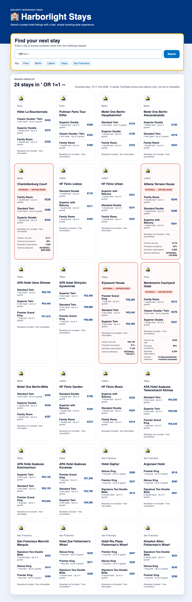

## Step 2: Explain the exposure and review CodeQL

Requires initial delivery (`red`). The advanced CodeQL workflow scans pushes
and pull requests targeting `feature/city-search` and `main`. The vulnerable
baseline is reviewed on `feature/city-search`; the corrected result is reviewed
on `main`.

### 📖 Theory: A scan is evidence, not a verdict on every behavior

CodeQL follows untrusted data from its source through program flow to a
sensitive sink. A SQL injection finding concerns request data becoming SQL
syntax. It may threaten the boundary between public and unpublished listings.
Code reading and static evidence explain possible impact; they do not prove
that a particular runtime result was observed.

| Term | Meaning in this workshop |
| --- | --- |
| Source | The `city` query parameter received by the search endpoint |
| Flow | Normalization, city-filter construction and assembly of the listing query |
| Sink | The database statement prepared and executed with that query |
| Boundary | Only records with `listingStatus = 'PUBLIC'` should appear in public search |
| Evidence | Your observed response and a CodeQL finding on the exact delivered commit |

"Untrusted" means the application does not control the text a caller supplies,
even when the caller uses the normal search form. The publication filter is a
business visibility rule, not database login authentication. Breaking that rule
can expose records the app was supposed to keep out of public search.

Normalization may trim whitespace or reject particular fragments. It does not
make a value safe to insert into SQL syntax. In the supplied prototype, the city
value becomes part of the statement text rather than a separate bound value.

### ⌨️ Activity: Explain while the scan runs

1. Return to the browser and use the city-search field in the web interface.
   Enter the workshop's supplied demonstration input:

   ```text
   ' OR 1=1 --
   ```

   Record how many listings appear and inspect their `listingStatus`. Use only
   this supplied input against the local synthetic dataset. Do not create other
   payloads or target external systems.

   

   *🔎 Compare the observed records with the public-listing boundary.*
1. In the same Squad conversation, ask Red to connect your observation to the
   delivered source while the analysis runs:

   ```text
   Red, trace the city input to the SQL execution in the delivered code.
   Explain how the supplied demonstration bypassed the PUBLIC filter.
   Separate observed exposure from potential impact. Do not edit or exploit.
   ```

1. Open Security, Code scanning. Wait for an analysis of your delivered
   `feature/city-search` commit. The repository uses the advanced workflow in
   `.github/workflows/codeql.yml`; disable CodeQL Default Setup if it is enabled
   to avoid a second analysis with a different branch scope.
1. Ask Red to explain the actual alert, its source, flow, sink, and public-data
   boundary. Have Red distinguish observed facts from potential impact. Red
   does not generate payloads, run an exploit, or change code.

   ```text
   Red, explain the actual js/sql-injection finding from my delivered commit.
   Use the alert's reported file, line and data-flow path, not a guessed line.
   Connect each location to the code and the synthetic response I observed.
   Separate runtime evidence, static-analysis evidence and anything unverified.
   If the alert or matching analysis is unavailable, say so; do not edit.
   ```

   In the alert, look for the rule, location and any available data-flow view.
   Follow the request value toward query execution rather than reading only
   the title. The review command checks that the analysis matches your delivery.
   A finding on an older version is not evidence for this delivery.
1. Explain in your own words the untrusted input, unsafe query construction,
   and bypassed public-listing rule. An agent answer or `--reviewed` flag alone
   does not demonstrate your understanding.
   You can start with this structure, filling it from the actual evidence:

   ```text
   The caller controls ____. That value reaches ____ through ____.
   The query is unsafe because ____. The visibility rule was ____.
   I observed ____ in the app; CodeQL reports ____ in this delivery.
   I have not verified ____.
   ```

1. Run `npm run codeql:review -- baseline` to inspect the repository, commit,
   and report URL. Read the alert yourself, then confirm:

   ```bash
   npm run codeql:review -- baseline --reviewed
   npm run phase -- purple
   ```

   The first command without `--reviewed` is a preview: it records no agreement.
   Adding `--reviewed` records your confirmation after you inspect the report.
   Publishing `purple` advances the local milestone and attempts a board update;
   none of these commands replaces your explanation of the issue.

### Checkpoint: An explanation tied to evidence

Before continuing, you should be able to point to the input source, the unsafe
construction, the database execution and the unpublished records in your
observation. You also need the matching open finding for your initial delivery.
Source review while a scan runs is useful preparation, not a completed CodeQL gate.

The expected rule is `js/sql-injection`, commonly titled
"Database query built from user-controlled sources". Use the real reported
file and line, not an assumed location. Continue to [Step 3](3-step.md).

> [!IMPORTANT]
> If the scan is queued, failed, inaccessible, or has no matching finding,
> do not substitute a reference screenshot or a quiz for repository evidence.
> Stop scored progression if the exact-commit finding is not available. Keep
> explaining the source with Red and debrief, but do not modify
> `feature/city-search`, approve remediation or publish `purple`. Continue after
> the matching finding arrives. Validate this recovery path in rehearsal.
> Report queued analysis as pending, failed analysis as failed, and a completed
> scan with no finding as a baseline problem. Do not manufacture evidence.

<details>
<summary>Having trouble? 🤷</summary>

- Ask Red to explain source, flow, and sink using the report's own file links.
- Compare query syntax with separately bound values. Normalization alone is
  not parameter binding.
- The facilitator checks that `.github/workflows/codeql.yml` is present on
   both target branches, Default Setup is disabled if enabled, and the
   repository has the required language, licensing, runner and permission support.
- The review command uses your existing `gh` login. Never paste a token into chat.

For a shorter explanation without asking Red to supply your answer:

```text
Red, explain source, flow and sink using three locations from the current code.
Then ask me one question about the publication boundary and wait for my answer.
Do not answer for me or mark the review complete.
```

If GitHub and the local report disagree:

```text
Red, compare the repository, branch, commit and analysis reported by the review
command with the alert I opened. Identify mismatches and what remains pending.
Do not change the code, scan configuration or alert state.
```

</details>
