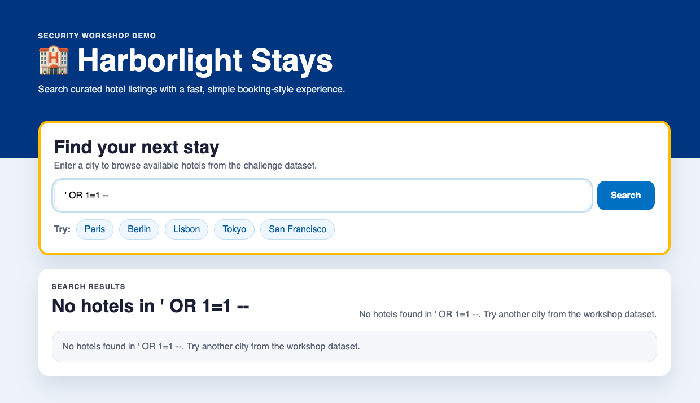

## Step 4: Deliver the correction and confirm fixed

Requires recorded participant approval.

### 📖 Theory: Local tests and hosted scans answer different questions

Local checks test behavior. A completed CodeQL analysis describes the pushed
commit. The original alert must become fixed, not dismissed or missing.
Neither a successful push nor an empty alert page while a scan is pending
proves that result.

There are three separate versions to track: files on disk, the code loaded by
the running app, and the commit pushed to GitHub. Editing a file does not reload
an already running Node.js process. Restart before runtime checks, then record
the corrected delivery SHA after pushing. Do not compare the first alert with
a scan of an unrelated commit or repository.

### ⌨️ Activity: Implement, deliver, review

1. Ask Blue to create `fix/city-search` from the delivered
   `feature/city-search` baseline and apply only Green's approved patch and its
   agreed tests. This keeps the vulnerable baseline branch unchanged. Use the
   same Squad conversation:

   ```text
   Blue, create fix/city-search from feature/city-search and apply only Green's
   exact patch that I approved. Preserve normal search and the other filters.
   Show the correction diff against feature/city-search and local verification
   results. Do not commit, push, open a PR or merge until I authorize it.
   ```

1. Restart the app with `npm run workshop:restart`. Ask Blue to run
   `npm run verify` against the corrected code. Review the result and publish
   `npm run phase -- green` only after it passes.
   Reuse the normal search and the supplied demonstration input: normal search
   still works, but the demonstration must return no unpublished records.

   | Check | Expected corrected behavior |
   | --- | --- |
   | `Paris`, then `paris` | The same two public listings |
   | Unknown or empty city | No listings |
   | Supplied demonstration input | No listings, not just hidden unpublished rows |
   | Existing filters, details and partner summary | Previously agreed behavior preserved |

   

   *✅ Confirm the corrected result after restarting the app.*

   Ask Blue to separate code review from observed results:

   ```text
   Blue, show the approved diff you applied and the checks actually run after
   restarting the app. Compare normal search and the supplied input with the
   baseline. Report failures or unchecked behavior; do not publish a phase.
   ```

1. Review the correction diff against `feature/city-search` and have Blue run
   the same behavior checks locally. Explicitly authorize Blue to commit the
   approved correction and tests on `fix/city-search`, push that branch and
   open a PR targeting `main`. Blue must not push to `feature/city-search` or
   push directly to `main`.

   ```text
   Blue, I authorize committing only the reviewed correction and agreed tests
   on fix/city-search, pushing that branch and opening a PR to main. Do not
   merge until I review the PR and explicitly authorize the merge. Report the
   PR URL and source commit. Do not claim CodeQL is clean from a PR.
   ```

1. Review the complete PR diff against `main`. It includes the initial feature
   as well as its correction because `main` predates city search. Check the PR
   results, then explicitly authorize the merge. Blue must not merge before
   your approval:

   ```text
   Blue, I reviewed the PR to main and its required checks passed. I explicitly
   authorize merging this PR. Report the merge commit and confirm it is on
   origin/main. Do not claim CodeQL is clean from a merge.
   ```

1. After the PR merges, update your local `main` and run the delivery regression
   in Terminal 1. Run each command separately:

   ```bash
   git switch main
   ```

   ```bash
   git pull --ff-only
   ```

   ```bash
   npm run regressions
   ```

   Regressions require the corrected PR to be merged to `main`; they are not an
   initial attack-demonstration step. Publish the delivery milestone after the
   regression passes:

   ```bash
   npm run phase -- blue
   ```

   The `blue` milestone confirms delivery, not hosted CodeQL completion.

   `npm run verify` checks local behavior and records correction evidence.
   `npm run regressions` checks the running app and records delivery evidence
   tied to the pushed commit. Publishing `green` or `blue` does not complete
   hosted analysis; you remain responsible for reviewing the result first.
1. Open the original finding in Security, Code scanning. Keep reporting
   CodeQL pending until analysis of that exact pushed commit completes.
1. Inspect `npm run codeql:review -- fixed`. After reading the report, run:

   ```bash
   npm run codeql:review -- fixed --reviewed
   npm run phase -- codeql
   ```

   Before confirming the report, you can ask Red for an independent explanation:

   ```text
   Red, compare the initial finding with the final CodeQL report. Does the
   same alert show fixed on my corrected SHA? Separate that evidence from
   passing local checks. If analysis is pending or failed, state what remains
   unverified. Do not dismiss the alert or change scan settings.
   ```

CodeQL clean is recorded only after the original finding is fixed and the
successful current analyses report no remaining findings. The final publisher
rechecks GitHub evidence rather than relying on an old receipt. Board updates
are best effort; local evidence is retained if the board is offline.

### Checkpoint: Local correction is not hosted confirmation

| Result you have | Claim you can make |
| --- | --- |
| Passing local verification | The tested behavior is corrected in the running app |
| Passing regressions and corrected commit on `main` | The correction is delivered, with CodeQL still pending if unconfirmed |
| Same alert fixed and successful exact-commit analyses clean | CodeQL confirmation is available for the corrected delivery |

Passing checks support specific claims, not "the whole app is secure". Retain
the initial SHA, corrected SHA and original alert URL. They tell you what was
delivered, what was reviewed, and which finding the final result resolves.

Continue to the [Review](x-review.md).

<details>
<summary>Having trouble? 🤷</summary>

- If verification differs from the diff, confirm the app restarted from the corrected code.
- If the PR is not merged, ask Blue to show its source branch, target branch,
  checks and scoped correction diff.
- If CodeQL remains open or fails, report that result and ask Red to inspect it.
- Missing or dismissed alerts do not count as fixed. Do not change scan settings
  to hide a finding or substitute another repository's result.
- If GitHub analysis is still pending, keep the workshop pending and resume
   the evidence review later. Do not publish final completion.

For a verification failure:

```text
Blue, diagnose the failing check before making another change. Confirm the
running app was restarted, show the expected and observed result, and identify
whether the approved patch or its test needs to change. Propose a scoped diff
and wait for renewed approval. Do not reset progress or weaken the check.
```

For a late scan:

```text
Red, summarize the corrected delivery SHA, passing local evidence and current
CodeQL status. Tell me exactly which hosted evidence is still missing and
what to inspect when analysis finishes. Do not mark the workshop complete.
```

</details>
