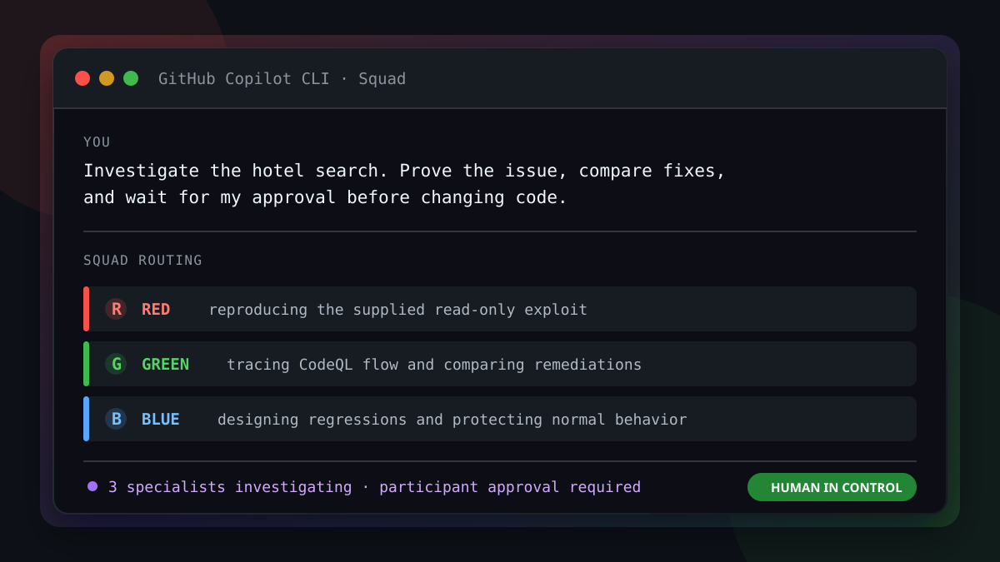
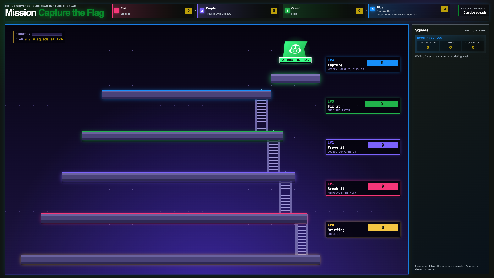

<h1>Capture the flag: Three AI teams, one codebase, zero mercy</h1>

<strong>Lead an AI purple team with GitHub Copilot, capture the hidden flag, and close the hole you just walked through.</strong>

  
  
  

## Welcome

- **Who is this for**: Developers, security practitioners, and technical leads
  who want to work with AI agents without handing over engineering judgment.
- **What you'll learn**: Prove a SQL injection with runtime evidence, trace it
  as a CodeQL flow (source → flow → sink), approve a parameter-binding fix, and
  verify it with local regressions.
- **What you'll build**: A one-line parameter-binding fix to a hidden SQL
  injection, verified by a regression matrix that protects the public-listing
  boundary and pushed to your repository's `main`.
- **Prerequisites**:
  - The private participant repository and Codespace your facilitator
    provisioned for you. The Codespace includes Node.js 22, `git`, `gh`, and
    `squad`.
  - Access to GitHub Copilot CLI.
  - Basic terminal and source-code familiarity. No penetration-testing
    experience is required.
- **How long**: 45 minutes: **10 min intro**, **30 min hands-on**, and
  **5 min debrief**.

In this exercise, you will:

1. 🔴 [Capture the flag with Red](.github/steps/1-step.md) and publish the `red` phase.
1. 🟣 [Trace the CodeQL flow and pass Mentor's check](.github/steps/2-step.md), then publish `purple`.
1. 🟢 [Approve the smallest safe correction](.github/steps/3-step.md) and record the approval.
1. 🔵 [Apply, test, commit, and push the approved patch](.github/steps/4-step.md), then publish `green` and `blue`.

Each phase is gated: it publishes only after the previous phase and its
evidence command have passed.

### The flag

The hotel search must return `PUBLIC` listings only. Unpublished listings carry
an internal reference, and one of them is your `FLAG{...}`.

## Meet Squad

**Squad** is a custom GitHub Copilot CLI agent that routes your natural-language
requests to specialist roles and manages the handoffs.
You run the setup commands yourself. You own every prediction, approval,
evidence review, and phase-ready decision; after that decision, the routed
agent runs the phase command.

> [!NOTE]
> Red, Green, Blue, and Mentor are workshop roles defined in this repository.
> This is not an official Squad product demonstration.

  

  Squad routes one investigation to Red, Green, and Blue. The participant
  remains responsible for approval and phase publication.

| Member | Does | Never |
| --- | --- | --- |
| 🧭 **Squad** | Routes requests and manages handoffs | Makes your decisions |
| 🔴 **Red** | Runs the canonical read-only exploit and captures the flag | Edits code or introduces a vulnerability |
| 🟣 **Mentor** | Grades your answers on the CodeQL flow before any fix is discussed | Reveals an expected answer |
| 🟢 **Green** | Explains the CodeQL flow and shows the exact fix diff | Edits code, or proceeds without your explicit approval |
| 🔵 **Blue** | Applies the approved patch, runs verification and regressions, commits and pushes `main` | Changes anything outside the approved scope |

Learn more about the upstream project in the
[Squad documentation](https://bradygaster.github.io/squad/).

### Workshop timing

| Minutes | Segment | What happens |
| --- | --- | --- |
| 0–10 | Intro | Squad, roles, and what the exercise proves |
| 10–17 | Step 1 | Setup, prediction, Red captures the flag |
| 17–24 | Step 2 | Green traces the CodeQL flow, Mentor checks you |
| 24–30 | Step 3 | You approve the exact patch |
| 30–40 | Step 4 | Blue applies, verifies, commits, and pushes |
| 40–45 | Debrief | Runtime evidence vs CodeQL, human vs automation boundary |

### How to start this exercise

1. Open the Codespace for your participant repository.
1. Go to [Step 1](.github/steps/1-step.md). It contains the full setup,
   pre-flight checks, and launch commands.
1. Run setup commands in the VS Code terminal, not in Copilot Chat.

  

  

