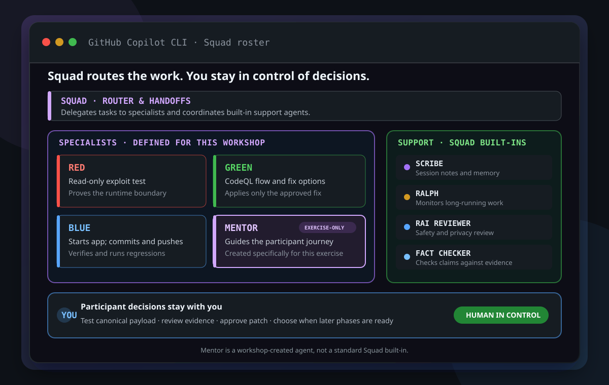

<h1>Capture the flag: Three AI teams, one codebase, zero mercy</h1>

<strong>Lead an AI purple team with GitHub Copilot, capture the hidden flag, and close the hole you just walked through.</strong>

  
  
  

## Welcome

- **Who is this for**: Developers, security practitioners, and technical leads
  who want to work with AI agents without handing over engineering judgment.
- **What you'll learn**: Prove a SQL injection with runtime evidence, trace it
  as a CodeQL flow (source → flow → sink), approve a parameter-binding fix, and
  verify it with local regressions and a final CodeQL report.
- **What you'll build**: A one-line parameter-binding fix to a hidden SQL
  injection, verified by a regression matrix that protects the public-listing
  boundary and pushed to your repository's `main`.
- **Prerequisites**:
  - The private participant repository and Codespace your facilitator
    provisioned for you. The Codespace includes Node.js 22, `git`, `gh`, and
    `squad`.
  - Access to GitHub Copilot CLI.
  - Actions and Code scanning enabled, with permission to read alerts and workflow
    runs through the authenticated `gh` CLI. Private repositories require the
    appropriate GitHub Code Security entitlement.
  - Basic terminal and source-code familiarity. No penetration-testing
    experience is required.
- **How long**: 45 minutes: **10 min intro**, **30 min hands-on**, and
  **5 min debrief**.

In this exercise, you will:

1. 🔴 [Capture the flag with Red](.github/steps/1-step.md) and publish the `red` phase.
1. 🟣 [Trace the CodeQL flow and pass Mentor's check](.github/steps/2-step.md), then publish `purple`.
1. 🟢 [Approve and verify Green's correction](.github/steps/3-step.md), then publish `green`.
1. 🔵 [Deliver with Blue and read the final CodeQL report](.github/steps/4-step.md), then publish `blue`.

evidence command and three-question checkpoint have passed. Purple and Blue also
Each phase follows the participant journey: Red publishes after the server
verifies your canonical browser test. Purple, Green and Blue retain their
evidence and three-question checkpoints. Purple and Blue require your actual
CodeQL reading, tied to the exact repository and main commit, unless you choose
an explicit override marked unverified.

### The flag

The hotel search must return `PUBLIC` listings only. Unpublished listings carry
an internal reference, and one of them is your `FLAG{...}`.

## Meet Squad

**Squad** is a custom GitHub Copilot CLI agent that routes your natural-language
requests to specialist roles and manages the handoffs. **Mentor** guides the
whole journey in one conversation, returning after every specialist report.
You run the setup commands yourself. You test Red's supplied payload in the
interface; the server advances Red when the expected evidence is confirmed.
You own every patch approval, CodeQL override, and later phase-ready decision.
Start with: **"Squad, start the app and ask Mentor to guide me."**
Blue starts Harborlight Stays; Mentor asks you to open it and describe what you see.
No application login or manual agent switching is required.

> [!NOTE]
> Red, Green, Blue, and Mentor are workshop roles defined in this repository.
> This is not an official Squad product demonstration.

  

  Red, Green, Blue, and Mentor are specialists defined for this workshop.
  Mentor was created specifically for the exercise; Scribe, Ralph, RAI Reviewer,
  and Fact Checker are Squad built-ins. The participant keeps decision authority.

| Member | Does | Never |
| --- | --- | --- |
| 🧭 **Squad** | Routes requests and manages handoffs | Makes your decisions |
| 🔴 **Red** | Explains the SQL injection and guides the canonical browser test | Edits code or introduces a vulnerability |
| 🟣 **Mentor** | Guides observations, CodeQL reading and checkpoints for Purple, Green and Blue | Answers before you try or skips a human decision |
| 🟢 **Green** | Explains CodeQL, proposes the exact diff, then implements and verifies it after approval | Edits before approval, commits or pushes |
| 🔵 **Blue** | Starts the app; after Green, verifies, commits and pushes `main`, then runs regressions | Changes anything outside the approved scope |

Learn more about the upstream project in the
[Squad documentation](https://bradygaster.github.io/squad/).

### Workshop timing

| Minutes | Segment | What happens |
| --- | --- | --- |
| 0–10 | Intro | Squad, roles, and what the exercise proves |
| 10–17 | Step 1 | Setup, Red explains the flaw, participant tests the payload |
| 17–24 | Step 2 | Green traces the CodeQL flow, Mentor checks you |
| 24–30 | Step 3 | You approve; Green implements and verifies; Red retests |
| 30–40 | Step 4 | Blue delivers; you read the clean CodeQL report |
| 40–45 | Debrief | Runtime evidence vs CodeQL, human vs automation boundary |

### How to start this exercise

1. Open the Codespace for your participant repository.
1. Go to [Step 1](.github/steps/1-step.md). It contains the full setup,
   pre-flight checks, and launch commands.
1. Run initialization commands in the VS Code terminal, then continue the workshop in Copilot CLI with the local Squad agent. VS Code Chat does not provide the terminal access the workshop requires.

  

  

