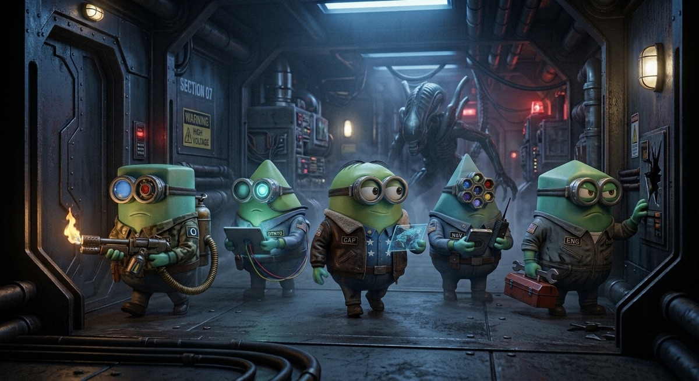

<h2>Capture the flag: Three AI teams, one codebase, zero mercy</h2>

<strong>Green delivers city search, Red reviews the exposure, and you approve Blue's correction through a PR to main.</strong>

  
  
  

## 👋 Welcome

- **Who is this for**: Developers, security practitioners, and technical leads
  who want to work with AI agents without handing over engineering judgment.
- **What you'll learn**: Recruit specialist agents, read a CodeQL finding,
  approve a correction, and distinguish local checks from hosted scan evidence.
- **What you'll build**: Green's isolated hotel-search prototype on
  `feature/city-search`, then Blue's parameter-bound correction on `main`.
- **Prerequisites**: Your participant Codespace, with Node.js 22, dependencies,
  GitHub Copilot CLI, `gh`, Squad and CodeQL prepared by the facilitator.
  Basic terminal familiarity is enough.

In this exercise, you will:

1. [Discover Squad, recruit your team, and deliver search](.github/steps/1-step.md).
1. [Explain the exposure and review the CodeQL finding](.github/steps/2-step.md).
1. [Ask Green for a correction and approve the scope](.github/steps/3-step.md).
1. [Ask Blue to deliver the correction and confirm CodeQL fixed](.github/steps/4-step.md).

The exercise uses real hotel names in public listings, with synthetic prices,
dates, room options and internal challenge records, plus a supplied training
prototype. Keep the app local or privately forwarded in Codespaces. Your goal
is to record normal search behavior first, then investigate the challenge and
restore public-only search with parameter binding.

*📊 The baseline: two public stays for Paris.*

## 🤝 Meet Squad

**Squad** coordinates three specialists through GitHub Copilot CLI.
You run the setup commands yourself and recruit **Blue**, **Red** and **Green**.
Copilot CLI runs the conversation; the Copilot coding agent is not a team member.

> [!NOTE]
> Red, Green, and Blue are workshop roles defined in this repository.
> This is not an official Squad product demonstration.

  

  Squad routes one investigation to Red, Green, and Blue. The participant
  remains responsible for approval and phase publication.

| Specialist | Responsibility |
| --- | --- |
| **Blue** | Implements the approved correction and opens a PR to `main`; merges only after participant approval |
| **Red** | Reviews code and CodeQL findings without editing |
| **Green** | Delivers the initial feature to `feature/city-search`, then advises on the correction |

Learn more about the upstream project in the
[Squad documentation](https://bradygaster.github.io/squad/).

Each step provides the commands, prompts and expected results when you need
them. Extra prompts under "Having trouble?" are optional.
You do not need to send every prompt to finish the exercise.

If analysis is pending, follow [Step 2](.github/steps/2-step.md) and report the
result accurately. A delivered correction can still be "CodeQL pending"; do not
report a pending scan as clean. The scoreboard displays your milestones and does
not independently analyze your code.

### 🚀 How to start this exercise

1. Open the Codespace for your participant repository.
1. Follow [Step 1](.github/steps/1-step.md) to initialize Squad, recruit your
  three specialists and launch the app.
1. Run shell commands in a VS Code terminal and send prompts in the Squad
  conversation. Keep that conversation open for the remaining steps.

  

*A humorous interlude, not a literal workshop roster. Explore [Brady Gaster's Squad project on GitHub](https://github.com/bradygaster/squad). 🤖*
