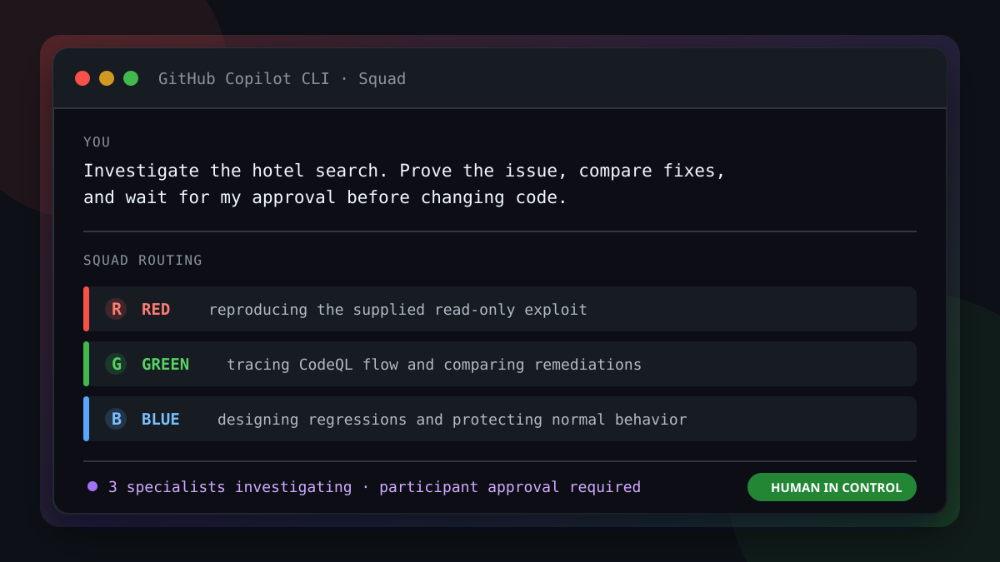

<div align="center">

<h2>Capture the flag: Three AI teams, one codebase, zero mercy</h2>

<p><strong>Ship public hotel search with Blue, review its security with Red, and approve Green's correction.</strong></p>

<p>
  <a href="https://githubuniverse.com/"></a>
  <a href=".github/steps/1-step.md"></a>
  <a href="https://github.com/features/codespaces"></a>
</p>

</div>

## Welcome

- **Who is this for**: Developers, security practitioners, and technical leads
  who want to work with AI agents without handing over engineering judgment.
- **What you'll learn**: Recruit specialist agents, read a CodeQL finding,
  approve a correction, and distinguish local checks from hosted scan evidence.
- **What you'll build**: Public hotel search by city, running locally and
  pushed to your repository's `main`, with its security reviewed.
- **Prerequisites**:
  - The private participant repository and Codespace your facilitator
    provisioned for you. The Codespace includes Node.js 22, `git`, `gh`, and
    `squad`.
  - Authenticated GitHub Copilot CLI and `gh`, installed dependencies, and
    permission to enable CodeQL in your repository.
  - Basic terminal and source-code familiarity. No penetration-testing
    experience is required.
- **How long**: 30 minutes: **3 min discovery**, **9 min delivery**,
  **8 min review**, **8 min correction**, and **2 min debrief**.

Installation and authentication happen before the timer. GitHub scan queues
are asynchronous and may extend the exercise. Never mark a pending scan clean.

In this exercise, you will:

1. [Discover Squad, recruit your team, and deliver search](.github/steps/1-step.md).
1. [Enable CodeQL Default Setup and review the finding](.github/steps/2-step.md).
1. [Ask Green for a correction and approve the scope](.github/steps/3-step.md).
1. [Ask Blue to deliver the correction and confirm CodeQL fixed](.github/steps/4-step.md).

You choose the task, review its result, and decide when to continue. There is
no required quiz. Board commands retain legacy color identifiers but represent
delivery milestones, not lessons or attack demonstrations.

The hotel search must return `PUBLIC` listings only. Unpublished records are
synthetic internal data, not an invitation to generate attack payloads.

## Meet Squad

**Squad** is a custom GitHub Copilot CLI agent that routes your natural-language
requests to specialist roles and manages the handoffs.
You run the setup commands yourself. You recruit Blue, Red, and Green, choose
their next task, and authorize edits and pushes. Squad keeps role boundaries
and context visible; it does not automatically complete the workshop for you.

> [!NOTE]
> Red, Green, and Blue are workshop roles defined in this repository.
> This is not an official Squad product demonstration.

<p align="center">
  
</p>

<p align="center">
  <sub>Squad routes one investigation to Red, Green, and Blue. The participant
  remains responsible for approval and phase publication.</sub>
</p>

| Member | Does | Never |
| --- | --- | --- |
| **Squad** | Routes your requests and preserves team context | Chooses your next task |
| **Blue** | Delivers the feature and implements approved corrections | Deliberately introduces a defect or pushes without authorization |
| **Red** | Reviews code and CodeQL evidence and explains impact | Edits code or automates exploitation |
| **Green** | Proposes an exact correction and its trade-offs | Edits the application |

Learn more about the upstream project in the
[Squad documentation](https://bradygaster.github.io/squad/).

### Workshop timing

| Minutes | Segment | What happens |
| --- | --- | --- |
| 0-3 | Discover | Recruit Blue, Red, and Green with Squad |
| 3-12 | Deliver | Blue implements public city search; you authorize push to `main` |
| 12-20 | Review | Enable Default Setup; Red explains actual CodeQL evidence |
| 20-28 | Correct | Green proposes; you approve; Blue implements and pushes |
| 28-30 | Debrief | Check the finding is fixed, or report CodeQL pending |

### How to start this exercise

1. Open the Codespace for your participant repository.
1. Go to [Step 1](.github/steps/1-step.md). It contains the full setup,
   pre-flight checks, and launch commands.
1. Run setup commands in the VS Code terminal, not in Copilot Chat.

The facilitator prepares repository access and checks the scan prerequisites
in the [facilitator repository](https://github.com/chriscrcodes/github-universe26-ctf-facilitator). If the delivered code has no SQL
injection finding, report that result. Do not introduce a defect to manufacture
the expected scenario or publish a fictitious remediation.

<p align="left">
  <a href=".github/steps/1-step.md"></a>
</p>

## Connect to the Workshop Board

The facilitator provides the board URL, session ID, and reporter token.
Set those values in your participant terminal without posting or committing
the token. This repository reports progress; it does not run or administer the board.

```bash
export BOARD_URL=http://127.0.0.1:8080
export BOARD_SESSION_ID=local-workshop
export ALLOW_LOCAL_BOARD=1
export BOARD_USER=your-github-login
# Set BOARD_TOKEN privately to the reporter token from your facilitator.
npm run register
```

`ALLOW_LOCAL_BOARD=1` enables localhost reporting. Keep it unset when connecting
to the shared workshop board. Every publisher must use the same `BOARD_SESSION_ID`.

For a board reset, ask your facilitator. All startup, deployment, and reset
operations are in the
[facilitator repository](https://github.com/chriscrcodes/github-universe26-ctf-facilitator).
